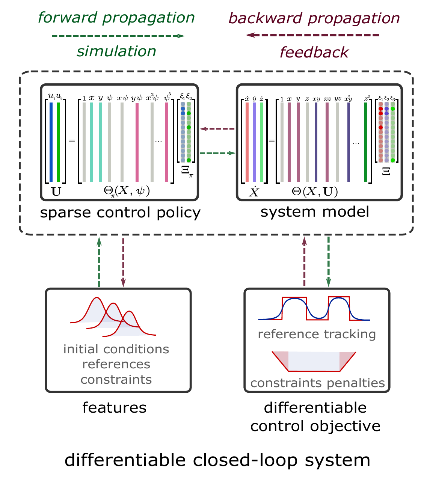

<div align="center">

# SparseDPC

### Differentiable Predictive Control with Sparse Dictionary Policies and Provably Fast Safe Online Adaptation

[](https://www.python.org/)
[](https://pytorch.org/)
[](https://github.com/pnnl/neuromancer)

</div>

SparseDPC is a research framework for learning compact, interpretable control policies with
Differentiable Predictive Control (DPC).
Both the dynamics and the policy are represented with sparse SINDy-style function
libraries. The repository covers system identification, predictive policy training,
online adaptation, safety constraints, and matched MPC and neural-policy baselines.

<p align="center">
  <a href="assets/DPC_simple_method_vert.pdf">
    
  </a>
</p>
<p align="center"><em>Sparse policy and system-model training through a differentiable closed loop.</em></p>

## Method

SparseDPC composes a sparse control policy with an identified sparse dynamics model. A
differentiable control objective evaluates reference tracking, control effort,
smoothness, and constraint penalties over the predicted closed loop. Gradients update
the policy coefficients directly, yielding a controller whose active terms remain
inspectable after training.

At deployment, the framework can adapt those coefficients online. For sparse models,
precompiled analytic derivatives propagate trajectory sensitivities without retaining
an autograd graph through the rollout. Autograd remains available for neural policies
and as a reference implementation.

## Key Capabilities

- Sparse SINDy system identification and interpretable SD-DPC policies
- Matched SD-DPC, NN-DPC, and nonlinear MPC training/evaluation objectives
- Straight-through action clamping for bounded policy training and adaptation
- Reference-tracking and predictive barrier-based online adaptation
- Analytic `df/dx`, `df/du`, `du/dx`, and `du/dXi` sensitivity propagation
- Euler and RK4 prediction for continuous systems
- Box, rotated-ellipse, and control-rate safety constraints
- Predictive safety filtering (PSF) as an optimization-based baseline
- Config-driven scripts, notebooks, checkpointing, metrics, and tests

## Case Studies

| Family | System | Task | Stages |
|---|---|---|---|
| [Relative degree one](Relative_Degree_One) | [Double Integrator](Relative_Degree_One/DoubleIntegrator) | Obstacle-avoiding motion planning | System ID, policy training, adaptation, PSF, MPC, evaluation |
| [Relative degree one](Relative_Degree_One) | [Two Tank](Relative_Degree_One/TwoTank) | Constrained level tracking | System ID, policy training, adaptation, PSF, MPC, evaluation |
| [Relative degree one](Relative_Degree_One) | [Van der Pol, two input](Relative_Degree_One/VanDerPol) | State regulation | System ID, policy training, MPC, evaluation |
| [Relative degree two](Relative_Degree_Two) | [Van der Pol, one input](Relative_Degree_Two/VanDerPol) | Conventional oscillator regulation | System ID, policy training, MPC, evaluation |

## Repository Layout

```text
SparseDPC/
|-- assets/                    # README method figure
|-- src/sdpc/                  # reusable SparseDPC framework
|   |-- systems/               # dynamics, data, objectives, and safety definitions
|   |-- sindy/                 # sparse libraries, models, and checkpoint I/O
|   |-- training/              # system-ID, SD-DPC, and NN-DPC training
|   |-- adaptation/            # reference, barrier, Jacobian, rollout, and PSF methods
|   |-- safety/                # state and control-rate constraint specifications
|   |-- baselines/             # CasADi/IPOPT MPC
|   |-- eval/                  # scenarios, rollouts, diagnostics, and metrics
|   `-- plotting/              # publication figures and matched animations
|-- Relative_Degree_One/       # DoubleIntegrator, TwoTank, two-input Van der Pol
|-- Relative_Degree_Two/       # conventional one-input Van der Pol
|-- scripts/                   # one command-line entry point per stage and system
|-- tests/                     # derivative, safety, training, and evaluation tests
`-- setup.py                   # editable package installation
```

See [`src/sdpc/README.md`](src/sdpc/README.md) for the framework API and
[`scripts/README.md`](scripts/README.md) for all command-line entry points.

## Installation

The experiments are developed with Python 3.10 and a Conda environment named
`neuromancer`:

```bash
conda create -n neuromancer python=3.10
conda activate neuromancer
pip install -e .
```

The requirements pin the direct dependencies from the tested `neuromancer` environment.
CasADi supports MPC and PSF, while JupyterLab, IPython, and the plotting packages support
the notebook workflow. `setup.py` reads the pinned `requirements.txt` directly, so the
editable install reproduces the tested dependencies.

## Quick Start

Each command runs one stage for one case study. For example:

```bash
python scripts/TwoTank/system_id.py
python scripts/TwoTank/train_sd_dpc.py
python scripts/TwoTank/train_nn_dpc.py
python scripts/TwoTank/unconstrained_adaptation.py
python scripts/TwoTank/safe_adaptation.py
python scripts/TwoTank/evaluation.py
```

Use `--config`, `--device`, or `--seed` to override a script's defaults:

```bash
python scripts/DoubleIntegrator/safe_adaptation.py \
    --config Relative_Degree_One/DoubleIntegrator/configs/safe.yaml \
    --device cpu --seed 7
```

The numbered notebooks call the same `sdpc` APIs as the scripts. Start with
`01_system_id.ipynb` in the selected case-study directory and proceed in numerical order.

## Citation

Citation information will be added with the associated SparseDPC publication. Until
then, please cite this repository and the foundational DPC paper linked above.

## Acknowledgements

SparseDPC is built with [Neuromancer](https://github.com/pnnl/neuromancer), PyTorch, and
CasADi.
